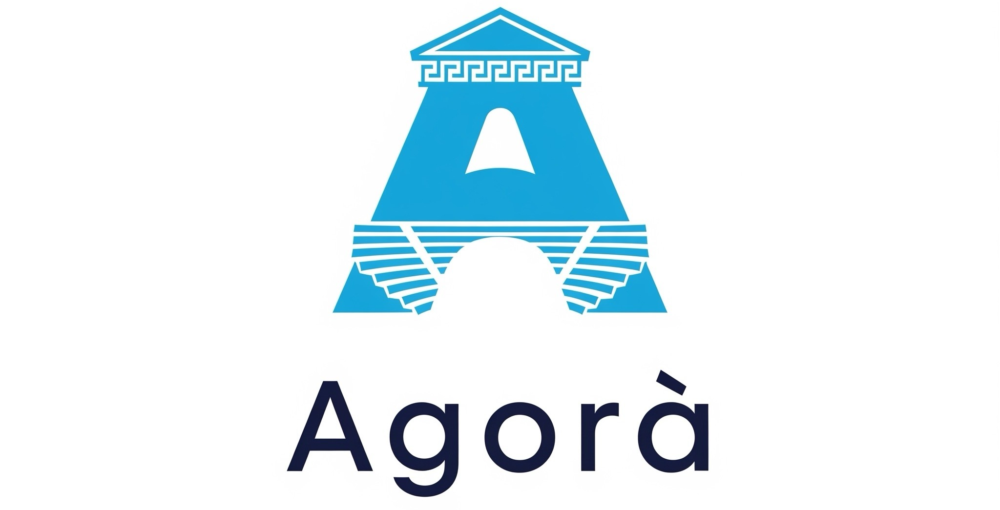

# 🏛️ Agorà: Il Civic-Network Europeo per la Conversazione Autentica

**Agorà** è più di un semplice social network: è uno **spazio civico digitale europeo** dedicato alla conversazione autentica, al dibattito costruttivo e alla creazione di comunità, libero dalle tossicità che spesso affliggono le piattaforme online. Ispirato all'antica agorà greca, il nostro obiettivo è ricreare un luogo di incontro e scambio di idee basato sul rispetto e sull'autenticità.

---

## ✨ Caratteristiche Chiave

- **🔐 Autenticazione Forte con CIE**: Registrazione esclusiva tramite Carta d'Identità Elettronica per garantire l'autenticità degli utenti e scoraggiare account falsi.
- **🚫 Tolleranza Zero per Contenuti Dannosi**: Politica rigorosa contro razzismo, offese, diffamazione e disinformazione grave, con potenziale perseguibilità penale.
- **🗣️ Focus sul Dibattito Costruttivo**: Strumenti per facilitare discussioni approfondite e rispettose, come filoni strutturati, sistemi di voto ponderato e funzionalità di sintesi.
- **🎨 Valorizzazione della Cultura Europea**: Promozione della diversità culturale e linguistica, con sezioni dedicate alla storia, all'arte e alle tradizioni europee.
- **🔒 Privacy e Protezione dei Dati**: Massima attenzione alla privacy degli utenti in linea con il GDPR e potenzialmente oltre.
- **🔗 Visione Futura**: Integrazione potenziale con servizi pubblici digitali europei per una maggiore verifica dell'identità (opzionale e con consenso).

---

## 🧭 In Sintesi

Agorà si posiziona come un social network europeo di nuova generazione, che mette al centro l'**autenticità**, la **civiltà del confronto** e la **valorizzazione dell'identità europea**. La registrazione con CIE è il primo passo fondamentale per creare un ambiente più sicuro e responsabile.

---

## 🤝 Come Contribuire

Siamo entusiasti del tuo interesse nel contribuire a rendere Agorà un social network europeo di valore! Ci sono diversi modi in cui puoi aiutarci:

- **🐛 Segnalare Bug**: Se trovi un bug o un problema, ti preghiamo di aprire una nuova "Issue" su GitHub descrivendo il problema nel dettaglio e, se possibile, i passaggi per riprodurlo.
- **💡 Suggerire Funzionalità**: Hai un'idea per una nuova funzionalità o un miglioramento? Apri una "Issue" proponendo la tua idea e spiegando perché pensi che sarebbe utile per Agorà.
- **👨‍💻 Contribuire con Codice**: Se sei uno sviluppatore e vuoi contribuire direttamente al codice, segui questi passaggi:
  1. Fai un "fork" del repository di Agorà sul tuo account GitHub.
  2. Crea un nuovo "branch" con un nome descrittivo per la tua modifica (es. `feature/nuova-funzionalita` o `bugfix/correzione-login`).
  3. Apporta le tue modifiche e assicurati che il codice sia ben commentato e segua le convenzioni del progetto.
  4. Scrivi dei test per il tuo codice, se applicabile.
  5. Invia una "pull request" dal tuo branch al branch principale del repository di Agorà. Descrivi chiaramente le modifiche che hai apportato nella tua pull request.

Esamineremo la tua pull request e ti forniremo un feedback. Potrebbe essere necessario apportare alcune modifiche prima che la tua contribuzione venga unita.

Apprezziamo molto il tuo contributo! I contributori significativi verranno riconosciuti pubblicamente nel README o in una sezione dedicata ai ringraziamenti.

---

## 🚀 Stack Tecnologico Consigliato

Per garantire coerenza, qualità e scalabilità nello sviluppo di **Agorà**, suggeriamo ai contributori di seguire le seguenti linee guida tecnologiche:

| Area              | Tecnologia consigliata                          |
|-------------------|------------------------------------------------|
| **Frontend**      | React o Vue + Chakra UI / Material UI          |
| **Backend**       | Node.js + Express o Python + FastAPI           |
| **Autenticazione**| Keycloak, OAuth2, integrazione CIE / eIDAS     |
| **Database**      | PostgreSQL (+ Elasticsearch per ricerca)       |
| **Realtime**      | Socket.IO + Web Push API                        |
| **Hosting**       | Cloud europeo (OVHcloud, Scaleway, AWS EU)     |
| **Container**     | Docker + Kubernetes                             |
| **CI/CD**         | GitHub Actions                                 |
| **Sicurezza**     | HTTPS, CSP, Rate Limiting, GDPR compliance     |
| **Accessibilità UX** | WCAG 2.1, ARIA, Lighthouse                    |

Questa lista rappresenta le tecnologie principali con cui sviluppare e mantenere Agorà, assicurando un ambiente moderno, sicuro e accessibile a tutti.

---

> Se hai suggerimenti o vuoi proporre tecnologie alternative, ti invitiamo ad aprire una issue per discuterne con la community.

## 📄 Licenza

**Copyright © 2025 [alessandrodigiusto.it]**

**Diritti sull'Idea**: L'idea concettuale di "Agorà: Il Social Civic Network Europeo per la Conversazione Autentica", inclusi i suoi principi fondanti e le sue caratteristiche distintive, sono di proprietà esclusiva di [alessandrodigiusto.it]. Nessuno è autorizzato a copiare, replicare o distribuire l'idea per scopi commerciali o per la creazione di piattaforme concorrenti senza esplicito permesso scritto da parte del proprietario.

**Licenza del Codice Sorgente**:

Chiunque è autorizzato a visualizzare, scaricare e contribuire con modifiche al codice sorgente di questo progetto tramite pull request. Inviando un contributo di codice, l'utente concede a [alessandrodigiusto.it] una licenza perpetua, irrevocabile, non esclusiva e gratuita per utilizzare, modificare e distribuire tale contributo all'interno di questo progetto.

Il copyright del codice rimane di proprietà del/dei rispettivi autori dei contributi, ma la licenza d'uso per il progetto è quella specificata sopra.

---

## 📬 Contatti

Per ulteriori informazioni, visita [alessandrodigiusto.it](https://alessandrodigiusto.it)

---
